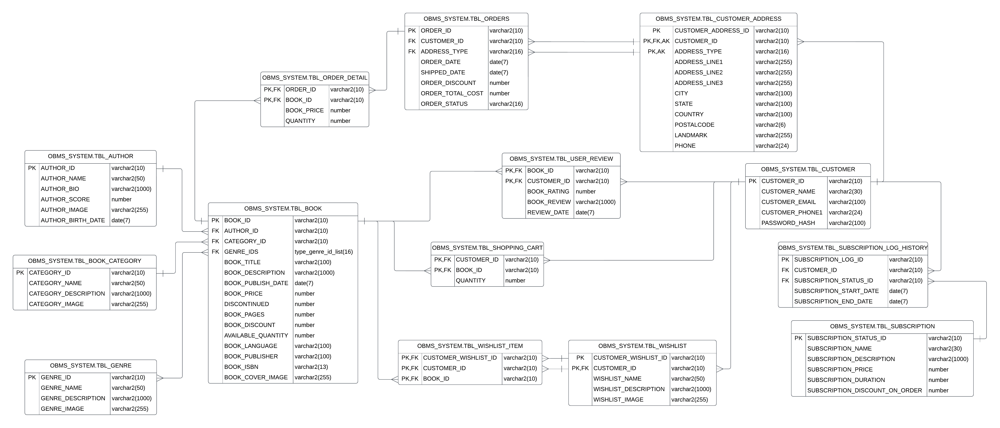

# 🛢️ Database Documentation

## 1. tbl_author
> Stores information about book authors.

**Columns:**
- `author_id`: Unique identifier for the author (VARCHAR2(10), Not Null, Primary Key)
- `author_name`: Name of the author (VARCHAR2(50), Not Null)
- `author_bio`: Short biography of the author (VARCHAR2(1000))
- `author_score`: Score assigned to the author (based on reviews or ratings) (NUMBER)
- `author_image`: URL of the author's image (VARCHAR2(255))
- `author_birth_date`: Date of birth of the author (DATE)

**Constraints:**
- `pk_author`: Primary key constraint on author_id
- `ck_author_id`: Ensures author_id starts with "au" followed by five digits
- `ck_author_score`: Ensures author_score is between 0 and 5

## 2. tbl_book_category
> Stores information about book categories.

**Columns:**
- `category_id`: Unique identifier for the category (VARCHAR2(10), Not Null, Primary Key)
- `category_name`: Name of the category (VARCHAR2(50), Not Null)
- `category_description`: Description of the category (VARCHAR2(1000))
- `category_image`: URL of the category image (VARCHAR2(255))

**Constraints:**
- `pk_book_category`: Primary key constraint on category_id
- `ck_category_id`: Ensures category_id starts with "bc" followed by five digits

## 3. tbl_genre
> Stores information about book genres.

**Columns:**
- `genre_id`: Unique identifier for the genre (VARCHAR2(10), Not Null, Primary Key)
- `genre_name`: Name of the genre (VARCHAR2(50), Not Null)
- `genre_description`: Description of the genre (VARCHAR2(1000))
- `genre_image`: URL of the genre image (VARCHAR2(255))

**Constraints:**
- `pk_genre`: Primary key constraint on genre_id
- `ck_genre_id`: Ensures genre_id starts with "ge" followed by five digits

## 4. tbl_book
> Stores information about books.

**Columns:**
- `book_id`: Unique identifier for the book (VARCHAR2(10), Not Null, Primary Key)
- `author_id`: Foreign key referencing tbl_author.author_id (VARCHAR2(10), Not Null)
- `category_id`: Foreign key referencing tbl_book_category.category_id (VARCHAR2(10), Not Null)
- `genre_ids`: Nested table type for storing genre ids (GENRE_ID_LIST)
- `book_title`: Title of the book (VARCHAR2(100), Not Null)
- `book_description`: Description of the book (VARCHAR2(1000))
- `book_publish_date`: Date when the book was published (DATE)
- `book_price`: Price of the book (NUMBER)
- `discontinued`: Discontinued status of the book (NUMBER, Default 0, Not Null)
- `book_pages`: Number of pages in the book (NUMBER)
- `book_discount`: Discount on the book (NUMBER, Default 0)
- `available_quantity`: Available quantity of the book (NUMBER)
- `book_language`: Language of the book (VARCHAR2(100))
- `book_publisher`: Publisher of the book (VARCHAR2(100))
- `book_isbn`: ISBN of the book (VARCHAR2(13))
- `book_cover_image`: URL of the book cover image (VARCHAR2(255))

**Constraints:**
- `pk_book`: Primary key constraint on book_id
- `ck_book_id`: Ensures book_id starts with "bo" followed by five digits
- `ck_book_book_price`: Ensures book_price is greater than 0
- `ck_discontinued`: Ensures discontinued is 0 or 1
- `ck_book_pages`: Ensures book_pages is greater than or equal to 0
- `ck_book_discount`: Ensures book_discount is between 0 and 1
- `ck_available_quantity`: Ensures available_quantity is greater than or equal to 0
- `fk_book_author`: Foreign key constraint referencing tbl_author.author_id. On delete cascade ensures that if an author is deleted, all associated books are also deleted.
- `fk_book_category`: Foreign key constraint referencing tbl_book_category.category_id. On delete cascade ensures that if a category is deleted, all associated books are also deleted.

## 5. tbl_customer
> Stores information about customers.

**Columns:**
- `customer_id`: Unique identifier for the customer (VARCHAR2(10), Not Null, Primary Key)
- `customer_name`: Name of the customer (VARCHAR2(30))
- `customer_email`: Email of the customer (VARCHAR2(100))
- `customer_phone1`: Primary phone number of the customer (VARCHAR2(24), Not Null)
- `password_hash`: Hashed password of the customer (VARCHAR2(100))

**Constraints:**
- `pk_customer`: Primary key constraint on customer_id
- `ck_customer_id`: Ensures customer_id starts with "cu" followed by five digits

## 6. tbl_customer_address
> Stores information about customer addresses.

**Columns:**
- `customer_address_id`: Unique identifier for the customer address (VARCHAR2(10), Not Null, Primary Key)
- `address_type`: Type of address (VARCHAR2(16), Not Null)
- `customer_id`: Foreign key referencing tbl_customer.customer_id (VARCHAR2(10), Not Null)
- `address_line1`: Address line 1 (VARCHAR2(255))
- `address_line2`: Address line 2 (VARCHAR2(255))
- `address_line3`: Address line 3 (VARCHAR2(255))
- `city`: City (VARCHAR2(100))
- `state`: State (VARCHAR2(100))
- `country`: Country (VARCHAR2(100))
- `postalcode`: Postal code (VARCHAR2(6))
- `landmark`: Landmark (VARCHAR2(255))
- `phone`: Phone number (VARCHAR2(24))

**Constraints:**
- `pk_customer_address`: Primary key constraint on customer_address_id
- `ck_customer_address_id`: Ensures customer_address_id starts with "ca" followed by five digits
- `ck_address_type_customer_id`: Unique constraint on (address_type, customer_id)
- `fk_customer_address_customer`: Foreign key constraint referencing tbl_customer.customer_id. On delete cascade ensures that if a customer is deleted, all associated addresses are also deleted.

## 7. tbl_subscription
> Stores information about subscription plans offered by the library.

**Columns:**
- `subscription_status_id`: Unique identifier for the subscription status (VARCHAR2(10), Not Null, Primary Key)
- `subscription_name`: Name of the subscription plan (VARCHAR2(30))
- `subscription_description`: Description of the subscription plan (VARCHAR2(1000))
- `subscription_price`: Price of the subscription plan (NUMBER)
- `subscription_duration`: Duration of the subscription plan (NUMBER)
- `subscription_discount_on_order`: Discount offered on book orders for subscribers (NUMBER, Default 0)

**Constraints:**
- `pk_subscription`: Primary key constraint on subscription_status_id
- `ck_subscription_status_id`: Ensures subscription_status_id starts with "su" followed by five digits
- `ck_subscription_price`: Ensures subscription_price is greater than 0
- `ck_subscription_discount_on_order`: Ensures subscription_discount_on_order is between 0 and 1

## 8. tbl_subscription_log_history
> Stores historical information about customer subscriptions.

**Columns:**
- `subscription_log_id`: Unique identifier for the subscription log (VARCHAR2(10), Not Null, Primary Key)
- `customer_id`: Foreign key referencing tbl_customer.customer_id (VARCHAR2(10), Not Null)
- `subscription_status_id`: Foreign key referencing tbl_subscription.subscription_status_id (VARCHAR2(10), Not Null)
- `subscription_start_date`: Start date of the subscription (DATE)
- `subscription_end_date`: End date of the subscription (DATE)

**Constraints:**
- `pk_subscription_log_history`: Primary key constraint on subscription_log_id
- `ck_subscription_log_id`: Ensures subscription_log_id starts with "sl" followed by five digits
- `fk_subscription_log_history_customer`: Foreign key constraint referencing tbl_customer.customer_id. On delete cascade ensures that if a customer is deleted, all associated subscription logs are also deleted.
- `fk_subscription_log_history_subscription`: Foreign key constraint referencing tbl_subscription.subscription_status_id. On delete cascade ensures that if a subscription plan is deleted, all associated subscription logs are also deleted.

## 9. tbl_shopping_cart
> Stores information about customer shopping carts.

**Columns:**
- `customer_id`: Foreign key referencing tbl_customer.customer_id (VARCHAR2(10), Not Null)
- `book_id`: Foreign key referencing tbl_book.book_id (VARCHAR2(10), Not Null)
- `quantity`: Quantity of the book in the shopping cart (NUMBER, Not Null)

**Constraints:**
- `pk_shopping_cart`: Primary key constraint on customer_id and book_id
- `ck_quantity`: Ensures quantity is greater than 0
- `fk_shopping_cart_customer`: Foreign key constraint referencing tbl_customer.customer_id. On delete cascade ensures that if a customer is deleted, all associated shopping cart items are also deleted.
- `fk_shopping_cart_book`: Foreign key constraint referencing tbl_book.book_id. On delete cascade ensures that if a book is deleted, the associated shopping cart items are also deleted.

## 10. tbl_wishlist
> Stores information about customer wishlists.

**Columns:**
- `customer_wishlist_id`: Unique identifier for the customer wishlist (VARCHAR2(10), Not Null)
- `customer_id`: Foreign key referencing tbl_customer.customer_id (VARCHAR2(10), Not Null)
- `book_id`: Foreign key referencing tbl_book.book_id (VARCHAR2(10), Not Null)
- `wishlist_name`: Name of the wishlist (VARCHAR2(50))
- `wishlist_description`: Description of the wishlist (VARCHAR2(1000))
- `wishlist_image`: URL of the wishlist image (VARCHAR2(255))

**Constraints:**
- `pk_wishlist`: Primary key constraint on customer_wishlist_id and customer_id
- `ck_wishlist_customer_wishlist_id`: Ensures customer_wishlist_id starts with "wi" followed by five digits
- `fk_wishlist_customer`: Foreign key constraint referencing tbl_customer.customer_id. On delete cascade ensures that if a customer is deleted, all associated wishlists are also deleted.
- `fk_wishlist_book`: Foreign key constraint referencing tbl_book.book_id. On delete cascade ensures that if a book is deleted, the associated wishlist items are also deleted.

## 11. tbl_wishlist_item
> Stores information about customer wishlist items.

**Columns:**
- `customer_wishlist_id`: Foreign key referencing tbl_wishlist.customer_wishlist_id (VARCHAR2(10), Not Null)
- `customer_id`: Foreign key referencing tbl_customer.customer_id (VARCHAR2(10), Not Null)
- `book_id`: Foreign key referencing tbl_book.book_id (VARCHAR2(10), Not Null)
  
**Constraints:**
- `pk_wishlist_item`: Primary key constraint on customer_wishlist_id, customer_id, and book_id
- `fk_wishlist_item_wishlist`: Foreign key constraint referencing tbl_wishlist.customer_wishlist_id and tbl_wishlist.customer_id. On delete cascade ensures that if a wishlist is deleted, all associated wishlist items are also deleted.
- `fk_wishlist_item_book`: Foreign key constraint referencing tbl_book.book_id. On delete cascade ensures that if a book is deleted, the associated wishlist items are also deleted.

## 12. tbl_user_review
> Stores information about customer reviews on books.

**Columns:**
- `book_id`: Foreign key referencing tbl_book.book_id (VARCHAR2(10), Not Null)
- `customer_id`: Foreign key referencing tbl_customer.customer_id (VARCHAR2(10), Not Null)
- `book_rating`: Rating given by the customer for the book (NUMBER)
- `book_review`: Review text given by the customer for the book (VARCHAR2(1000))
- `review_date`: Date when the review was submitted (DATE)

**Constraints:**
- `pk_book_rating`: Primary key constraint on book_id and customer_id
- `ck_book_rating`: Ensures book_rating is between 0 and 5
- `fk_book_rating_book`: Foreign key constraint referencing tbl_book.book_id. On delete cascade ensures that if a book is deleted, all associated reviews are also deleted.
- `fk_book_rating_customer`: Foreign key constraint referencing tbl_customer.customer_id. On delete cascade ensures that if a customer is deleted, all associated reviews are also deleted.

## 13. tbl_orders
> Stores information about customer orders.

**Columns:**
- `order_id`: Unique identifier for the order (VARCHAR2(10), Not Null, Primary Key)
- `customer_id`: Foreign key referencing tbl_customer.customer_id (VARCHAR2(10), Not Null)
- `address_type`: Type of address for shipping (VARCHAR2(16), Not Null)
- `order_date`: Date when the order was placed (DATE)
- `shipped_date`: Date when the order was shipped (DATE)
- `order_discount`: Discount applied to the order (NUMBER, Not Null)
- `order_total_cost`: Total cost of the order (NUMBER, Not Null)
- `order_status`: Status of the order (VARCHAR2(16))

**Constraints:**
- `pk_order`: Primary key constraint on order_id
- `ck_order_id`: Ensures order_id starts with "or" followed by five digits
- `fk_order_customer_address_customer`: Foreign key constraint referencing tbl_customer.customer_id and tbl_customer_address.address_type. On delete cascade ensures that if a customer or address is deleted, all associated orders are also deleted.
- `ck_customer_address_type`: Checks that the address_type is one of the predefined values ('Home', 'Office', 'Work', 'Other').
- `ck_order_discount`: Ensures order_discount is between 0 and 1
- `ck_order_total_cost`: Ensures order_total_cost is greater than or equal to 0

## 14. tbl_order_detail
> Stores detailed information about items in customer orders.

**Columns:**
- `order_id`: Foreign key referencing tbl_orders.order_id (VARCHAR2(10), Not Null)
- `book_id`: Foreign key referencing tbl_book.book_id (VARCHAR2(10), Not Null)
- `book_price`: Price of the book at the time of the order (NUMBER)
- `quantity`: Quantity of the book in the order (NUMBER, Default 1, Not Null)

**Constraints:**
- `pk_order_detail`: Primary key constraint on order_id and book_id
- `ck_book_price`: Ensures book_price is greater than or equal to 0
- `ck_order_detail_quantity`: Ensures quantity is greater than or equal to 1
- `fk_OrderDetails_Orders`: Foreign key constraint referencing tbl_orders.order_id. On delete cascade ensures that if an order is deleted, all associated order details are also deleted.
- `fk_OrderDetails_Products`: Foreign key constraint referencing tbl_book.book_id. On delete cascade ensures that if a book is deleted, the associated order details are also deleted.
